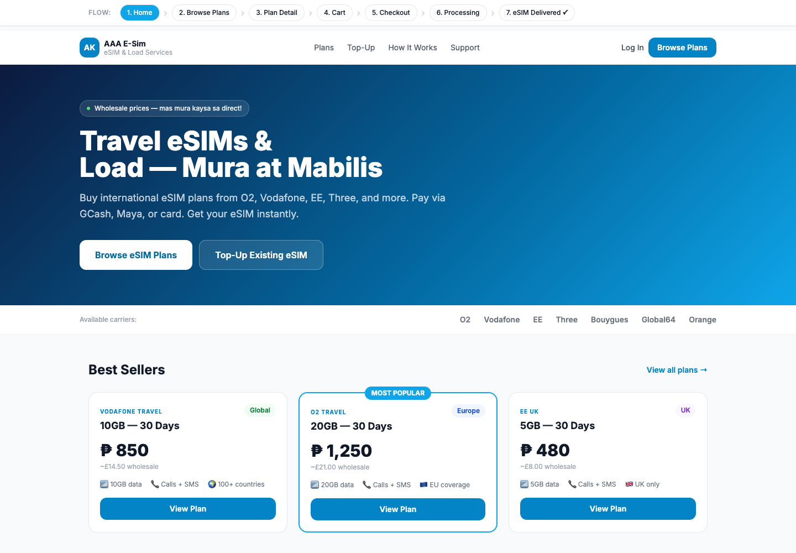
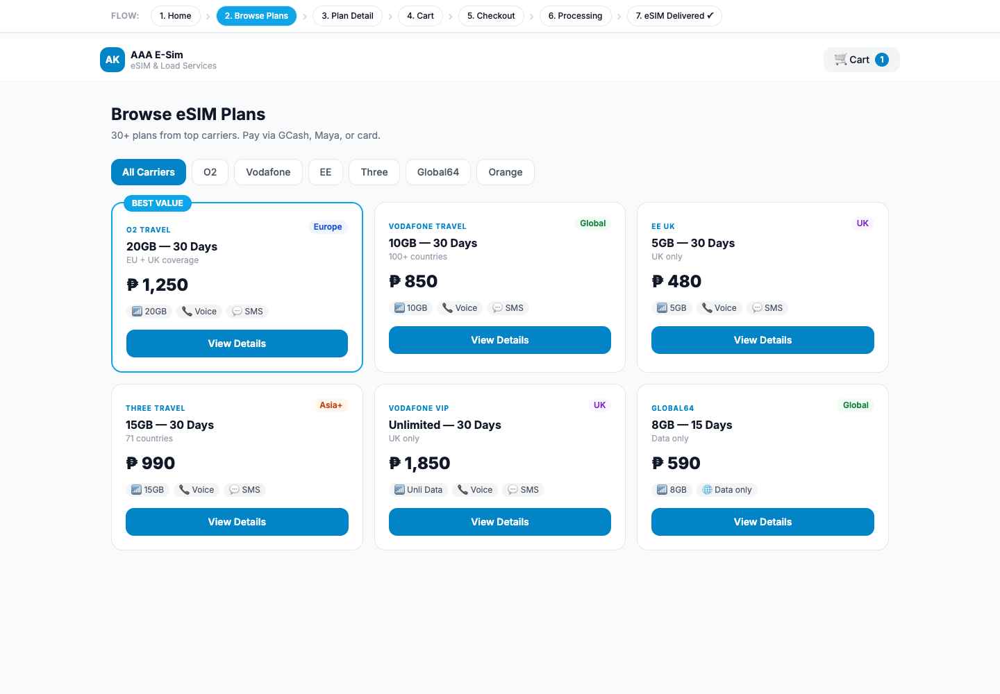
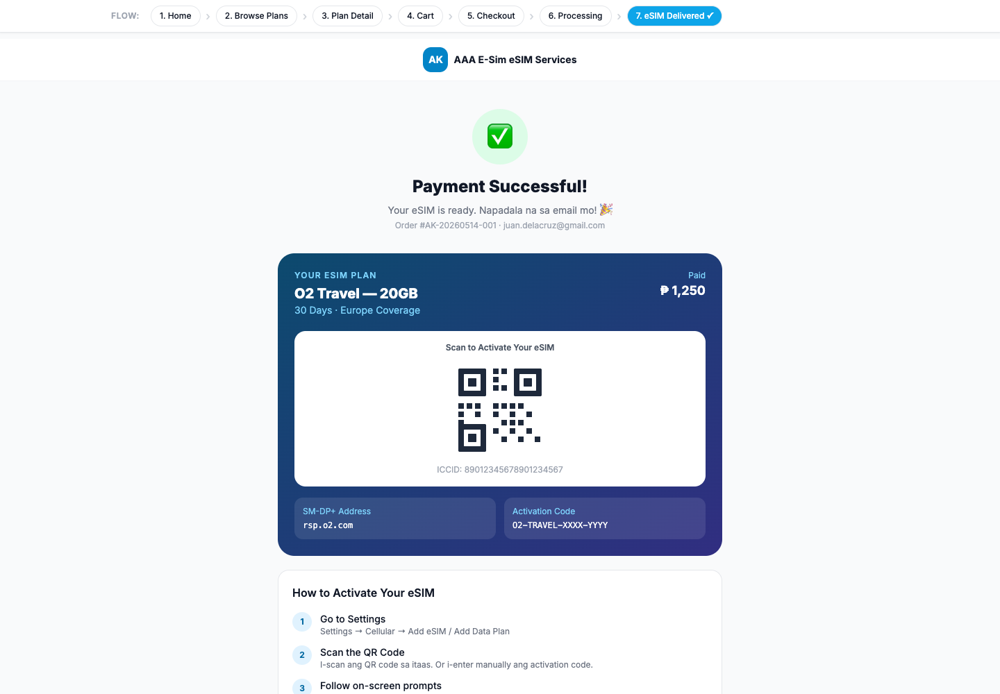
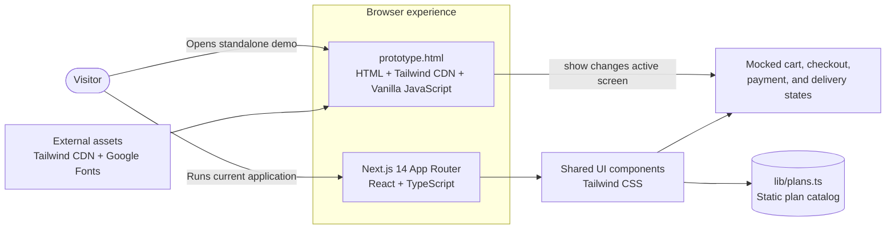
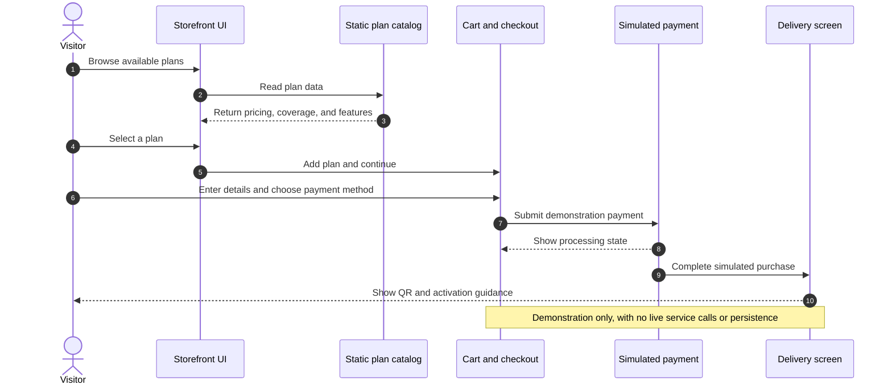

# AGUDATECH IT Solutions — eSIM Web Design Sample

A responsive eSIM storefront experience designed and produced under **AGUDATECH IT Solutions**. The initial concept is preserved in [`prototype.html`](./prototype.html), a standalone interactive demo that presents the complete purchase journey in one file.

## Design Highlights

- Seven connected screens: home, plan browsing, plan details, cart, checkout, payment processing, and eSIM delivery
- Responsive layouts for desktop and mobile viewports
- Clear pricing, coverage, and carrier comparisons
- Local payment options represented through GCash, Maya, and card flows
- Bilingual English and Filipino microcopy
- Delivery and activation guidance presented as part of the post-purchase experience
- Consistent sky-blue visual system, rounded cards, status badges, and focused calls to action

## Sample Screenshots

| Home | Plan browsing | Successful delivery |
| --- | --- | --- |
|  |  |  |

## Architecture and Technology Stack



## Happy Flow



## View the Original Prototype

The prototype is plain HTML with lightweight JavaScript navigation. It loads Tailwind CSS and Inter from external CDNs, so an internet connection is required for the intended styling.

```bash
python3 -m http.server 8000
```

Then open [http://localhost:8000/prototype.html](http://localhost:8000/prototype.html). Use the flow controls at the top or the in-page actions to move through the experience.

## Technology

- HTML5
- Tailwind CSS via CDN
- Vanilla JavaScript
- Google Fonts — Inter

## Current Implementation

The repository also contains a Next.js 14 and TypeScript implementation of the same core design direction. Run it with:

```bash
npm ci
npm run dev
```

The purchase experience is a design demonstration: product data, payment states, order details, and QR information are illustrative rather than connected to live services.

---

**Designed and produced by AGUDATECH IT Solutions.**


## Contribution

This project is open for collaboration. If you wish to contribute:

    Fork the repository.
    Create a feature branch (git checkout -b feature/your-feature-name).
    Commit your changes (git commit -m 'Add your feature').
    Push to the branch (git push origin feature/your-feature-name).
    Open a pull request.

## Contact

For any questions or inquiries, please reach out to www.linkedin.com/in/agudatech/.

## Support

If you find this project helpful and would like to support its ongoing development, consider buying me a coffee! Your support helps me keep working on this project and developing more features.

[](https://www.buymeacoffee.com/mauriceague)
